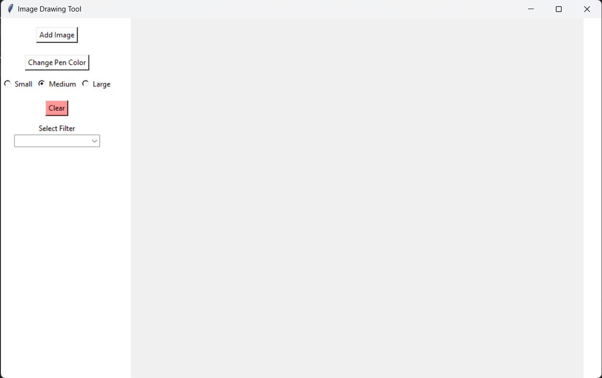

# Image Editing Tool

A simple image drawing tool built with Python and Tkinter that allows you to open, edit, and apply filters to images.

## Details

This image drawing tool is built using Python and Tkinter for the graphical user interface. It utilizes the Pillow library (PIL) for image processing operations. The tool provides features such as opening and editing images, changing pen color and size, applying filters, and clearing the canvas.

### Required Modules
Make sure you have the following modules installed:
- tkinter
- Pillow (PIL)
- ttk from tkinter

You can install Pillow and ttk using pip: pip install Pillow

## Features

- Open and display images.
- Draw on the canvas with various pen sizes and colors.
- Change the pen color using a color picker.
- Apply image filters, including Black and White, Blur, Sharpen, Smooth, and Emboss.
- Clear the canvas to start over.

## Getting Started

- To get started, clone this repository to your local machine: git clone https://github.com/Bisalkumar/Image-Editor.git

## How to Use

1. Run the Python script (`main.py`).
2. Click the "Add Image" button to open an image.
3. Draw on the canvas with the selected pen size and color.
4. Use the "Change Pen Color" button to pick a different pen color.
5. Select a pen size (Small, Medium, Large).
6. Choose a filter from the "Select Filter" dropdown and click on it to apply the filter.
7. Click the "Clear" button to clear the canvas and start over.

## Screenshots

## Contributions

Contributions are welcome! If you have any improvements or new features to suggest, please create a pull request.

## License

This project is licensed under the MIT License - see the [LICENSE](LICENSE) file for details.

## Acknowledgements

- Thanks to the open-source community for providing the libraries and tools used in this project.